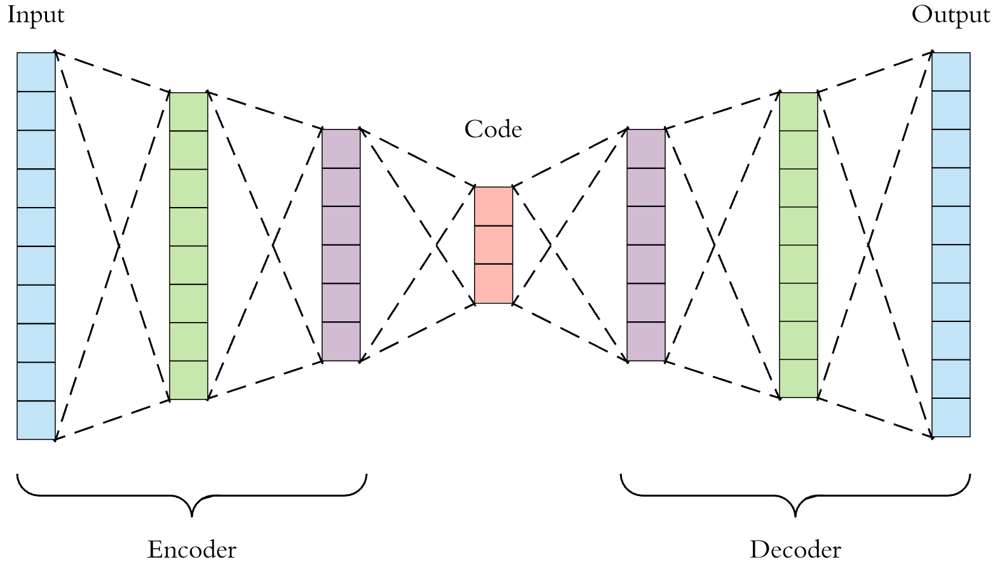

# Applications of Principal Component Analysis to engineering problems

# Rationale
課程中學習到PCA，覺得這個工具十分好用，能夠將多維度空間進行特徵壓縮，取出變化率最高的特徵向量，進而比較出資料中分群的結果，這項工具可以算是機器學習的基礎，我個人也對於機器學習很有興趣，所以當老師在介紹時，就想選擇PCA作為報告，能更加瞭解PCA也能學習一些機器學習實作面的技術。

# Problem background including the problem difficulties
如果拿到一大筆資料，需要進行分類，然而這類資料有許多特徵，若想直接進行分析，分出個別的類型很容易浪費時間、甚至找不出任何的結果，若想進行高維度資料的分群，必先進行降維，稍微介紹資料分析中五種降維方法:

(a)	Missing Values Ratio
包含太多缺失值的資料列包含有用信息的可能性較少，將資料列缺失值大於某個閾值的列去掉。

(b)Low Variance Filter
方法假設資料列變化非常小的列包含的信息量少。因此，所有的資料列方差小的列被移除。

(c)High Correlation Filter
認為當兩列資料變化趨勢相似時，它們包含的信息也相似，使用相似列中的一列就可以滿足機器學習模型。

(d)PCA
對矩陣取出特徵值特徵向量，取出後第一個主成分具(第一大特徵值)有最大的方差值，每個後續的成分在與前述主成分在正交條件限制下具有最大方差(隨著遞減)，但新的主成分並不是由實際系統產生的，因此在進行 PCA 變換後會喪失資料的解釋性。	
(e) Random Forests
	對目標屬性產生許多巨大的樹，然後根據對每個屬性的統計結果找到信息量最大的特徵子集。

**評論pca**:
優: 利用降維技術將少數綜合變量來代替原始多個變量，這些綜合變量卻能集中原始變量的大部分信息，能對客觀的現象進行科學分數的評價、分類。

缺: 進行 PCA 變換後會喪失資料的解釋性，函數意義不明確。

# Solutions with linear algebra techniques
當必須分析依樣具有多項特徵的物件時，不太可能直接利用原始數據處理，若是2維或3維還能利用畫圖來表示，查看彼此關聯，但是上百維度的資料，基本上直接分析會有很大的難度，所以就需要現代學習到的pca分析，將大量特徵資料壓縮成三維、二維，能夠圖形化，就比較好進行資料分群。

# Examples/applications
(a)簡介:
在這邊使用tensorflow做為我pca應用的例子，tensorflow是一款google開發的專為機器學習所做的套件，我取用tensorflow內部的data做為分析的資料集。
此處會實做一個機器學習中非監督式學習系統的autoencoder(自編碼)架構

(b)大致架構介紹:
Autoencoder(一種神經網路)的架構如下圖:

Autoencoder架構:
大致架構為從input壓縮(encoder)feature 再解壓(decoder)成ouput(原始大小) ，通過對比原始input跟解壓後ouput、減少誤差，進行反向傳遞來回訓練，訓練出中間code的準確性(能擷取數據中最具代表性的信息)，就能得到input中最重要的特徵。

(c)資料集:
Mnist是一連串手寫數字的資料圖片，被包含在tensorflow dataset裡面，只要有tensorflow package都能使用

資料集分成三個部分(圖片品質:78*78pixel)
1. 55,000 筆的 training data (mnist.train)
2. 10,000 筆的 test data (mnist.test)
3. 5,000 筆的 validation data (mnist.validation)
如下圖所示(testdata中取出前10張圖):
 
	

(d)資料處理流程:

Load data:
把data從package取出，並存取到變數中。

Preprocess:
先將圖片(matrix)拉平成一個28x28 = 784 的向量(array)，要確保對於每張圖片都是用同樣的方法拉平，從這個角度來看，處理過後的data變成一個784維向量空間裡是每個圖片的 pixel 點， pixel 點是一個介於0到1的值，表示 pixel 點的強度，以此類推train、validation datas。

Input->encoder:
把data放進encoder降低維度，我的降維方法(encoder)是從784->128->64->10->2維。

Cost
定義如下，(y_true-y_pred)^2，y_true為原本784維的data(input)、y_pred為decode後的data(output)，這是我訓練的誤差(重新跑程式訓練出誤差會有些許不同):
0001 cost= 0.443491876
0002 cost= 0.067692645
0003 cost= 0.059050784
0004 cost= 0.054548491
0005 cost= 0.052832965
0006 cost= 0.052148856
0007 cost= 0.049073890
0008 cost= 0.049046505
0009 cost= 0.047980472
0010 cost= 0.043169461

pca:
用2維的code畫出pca plot 
pca如下圖所示，因為有九種分類所以圖其實蠻雜亂的，所以我另外畫了分別的圖分別是數字(1,2,6,8,9)
 

數字1:								數字2:
數字6:								數字8:

數字9:
看這五張圖後，可以發現雖然每張數字都有一些點沒有被分得很好(out)，但是可以發現每張圖大部分的會聚集在同一個區域，算是有分類出一點結果。

decode->ouput
若從2維以同樣方法逆推回784維，就可以取回精簡過後的原圖，可以發現它確實有取出原圖的特徵，顯示在新圖上。
 

V. Discussions 
	這次報告對於原本的pca更加了解，從上課時比較虛幻的variance、covariance、correlation公式，並取得eigenvalue、eigenvector，會計算但是對於pca還不了解，在做報告時上網學習了更多資訊，並將pca真實應用在機器學習上，才真正理解到pca這項工具強大。
	在機器學習領域，不只有autoencoder能用到pca，很多機器學習的方法都需要降維，而降維就能利用到pca，所以pca真的是很有用的工具。

Code連結: https://github.com/Samuel1043/pca_practice/tree/master

VI. References.
https://github.com/tensorflow/tensorflow/blob/7c36309c37b04843030664cdc64aca2bb7d6ecaa/tensorflow/contrib/learn/python/learn/datasets/mnist.py#L160
https://github.com/MorvanZhou/tutorials/blob/master/tensorflowTUT/tf21_autoencoder/full_code.py
https://github.com/aymericdamien/TensorFlowExamples/blob/master/notebooks/3_NeuralNetworks/autoencoder.ipynb
http://www.cs.toronto.edu/~fritz/absps/esann-deep-final.pdf
https://www.youtube.com/watch?v=F2h3tbC-sBk&t=411s
https://ithelp.ithome.com.tw/articles/10177186
